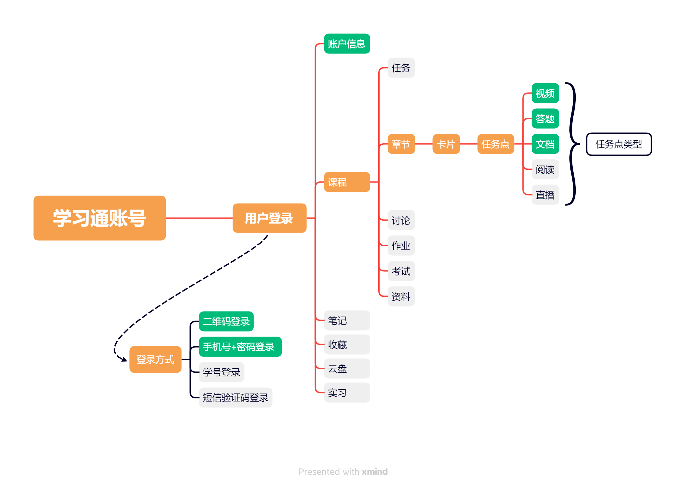
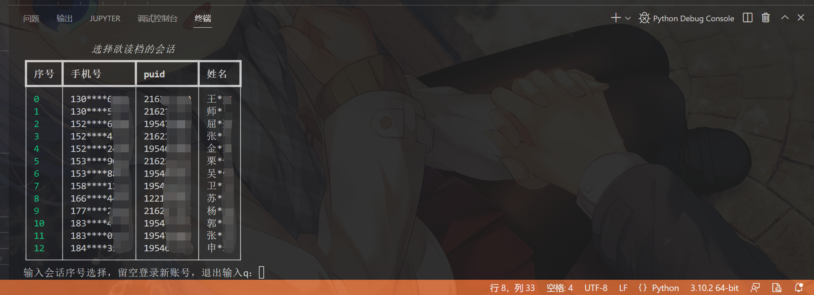
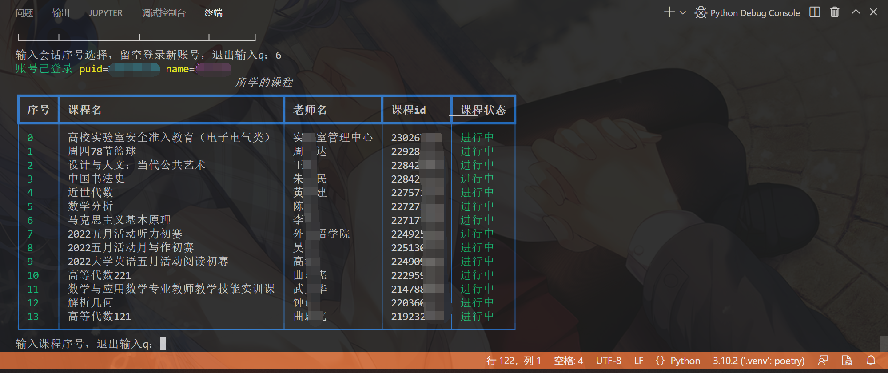
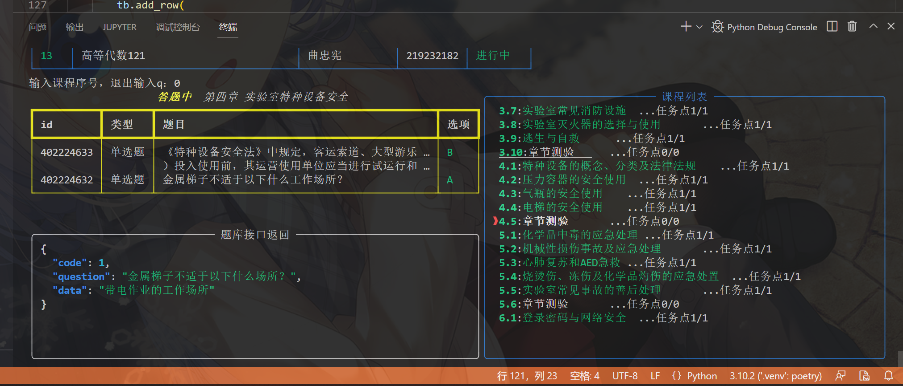
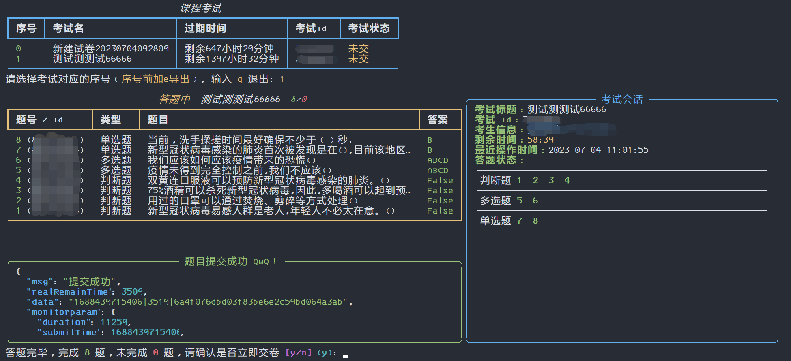

<div align="center">
    <h1>超星学习通答题姬</h1>
    <h2>CxKitty</h2>
    
    
    
    
    
</div>

本项目旨在研究学习爬虫技术和网络接口编程技术，同时致力于以开源方式抵制并消灭各种付费“刷课平台”和“黑产”

<span style="color: red"><b>Ps: 本项目不提供任何题库资源，有相关测试需求者请按照文档自行解决。本项目仅供学习参考使用，请在下载部署后 24 小时内删除，由于使用本项目不当所造成的挂科或不良学习记录作者一概不负责。</b></span>

## ✨Features

### Supports

- 会话管理
  - ✅支持手机号+密码登录、二维码登录，可以自动 / 手动重登账号
  - ✅内置多账号管理器，自动存取账号信息，自动判断会话 ck 有效性，以 json 格式存档在本地
- 交互
  - ✅以 Terminal-UI 方式进行人机交互，展示工作流程、章节任务点状态，输出详细信息到 log 文件，作为一个理工男，不觉得很酷吗？
  - ✅批量选择课程（使用序号 / courseId / 课程名）
- 协议实现
  - ✅使用 [requests](https://github.com/psf/requests) 及 [bs4](https://www.crummy.com/software/BeautifulSoup/) 分别进行协议模拟和 HTML 解析，故无需浏览器，更无需油猴脚本
  - ✅无惧接口风控，基于 [OpenCV](https://github.com/opencv/opencv) 与 [ddddocr](https://github.com/sml2h3/ddddocr) 对验证码进行识别，进而解除风控状态
  - ✅接口请求自动 retry 支持，针对网络环境不佳以及使用移动流量的场景优化
- 任务点
  - ✅视频课程任务点模拟播放（无需消耗流量播放流媒体内容）
  - ✅文档任务点模拟浏览（如 word ppt pdf 等）
- 考试及测验
  - ✅章节测验任务点自动答题，支持单选题、多选题、填空题、判断题，试题未完成可临时保存
  - ✅课程考试自动答题，支持单选题、多选题、填空题、判断题（考试模式、使用手机客户端协议）
  - ✅遇到匹配失败的题，可使用 fuzzer 方式填充答案并提交（默认关闭）
  - ✅章节测验试题 / 课程考试可完整导出，信息全、无加密无乱码，可导出临时保存的答案，现支持 json 格式
  - ✅自动答题功能需要至少一种的 **题库后端** 支持，现支持`REST API`、`JSON`、`SQLite`三种类型的 **题库后端**，同时已接入`Enncy`、`网课小工具（Go题）`两种第三方题库，可并行搜索，择优匹配答案（建议使用自建题库）
  - ✅`REST API`类型 **题库后端** （用户接口）支持使用 [JsonPath](https://goessner.net/articles/JsonPath/) 语法进行答案字段提取，允许用户注入 HTTP header 和 params 依赖字段
  - ✅日志中将记录未完成的题目，并自动导出未完成的题目到 json

### TODO

以下特性有可能逐渐被添加

- ❌短信验证码登录、学号登录
- ❌直播任务点、文章阅读任务点
- ❌简答题、论述题等题型支持
- ❌富文本答题
- ❌使用 Gotify 或 MQTT 上报任务进度以及完成情况
- ❌使用 args 直接传参登录账号以及选课
- ❌导出已批阅的章节测验
- ❌试题自动等待交卷

### BUGS

- ⭕获取任务点状态会出现 `0/0`的情况 (即使任务点存在未做)
- ⭕对于选项为图片的题目无法匹配

## ❤️Contributing Guide

若发现程序存在任何 bug 或有好的想法，欢迎提交 Issue，提交 bug 反馈时需要带上报错信息截图（截全）以及对应 log 文件，并说明触发条件

如果有能力一同开发项目，欢迎使用 [PR](https://github.com/SocialSisterYi/CxKitty/pulls) 提交代码（注意合并 Origin 和修改内容

提交 Issue 时应当遵守 **[提问的智慧](https://github.com/ryanhanwu/How-To-Ask-Questions-The-Smart-Way/blob/main/README-zh_CN.md)** 以及[别像弱智一样提问](https://github.com/tangx/Stop-Ask-Questions-The-Stupid-Ways)，切勿以`不懂`、`萌新问个问题`、`小白啥也不会浇浇`、`整个xxx呗`作为标题，否则一律忽略

[Issue](https://github.com/SocialSisterYi/CxKitty/issues) 为本项目的唯一反馈渠道，任何包括不限于在 QQ、B站私信、Telegram、微信 的提问一律忽略

## 🧩Typographical



## 🚀Build

### 💻本地化构建项目

使用 Python 版本 >= 3.10.0

clone 项目到本地，并使用 poetry 安装依赖和管理 venv

```bash
git clone 'https://github.com/SocialSisterYi/CxKitty'
cd CxKitty
poetry install
```

运行主程序

```bash
poetry run python3 main.py
```

### 🐋使用  Docker  构建项目

从 DockerHub 拉取最新镜像

```bash
docker pull socialsisteryi/cx-kitty
```

~~或手动构建镜像~~

<details>
<summary>展开</summary>

clone 项目到本地，并开始构建镜像

```bash
git clone 'https://github.com/SocialSisterYi/CxKitty'
cd CxKitty
docker build --tag socialsisteryi/cx-kitty .
```

</details>

运行容器

请按实际情况映射以下容器内路径：

`/app/session`会话存档目录

`/app/logs`程序日志目录

`/app/export`试题导出目录 (根据配置文件修改，**如不需要可不映射**)

`/app/config.yml`程序配置文件

`/app/questions.json`json题库 (根据配置文件修改，**如不需要可不映射**)

`/app/questions.db`sqlite题库 (根据配置文件修改，**如不需要可不映射**)

由于程序使用 TUI，Docker 的日志服务会自动捕获并保存容器的 stdo，所以建议使用参数`--log-opt max-size=xx`限制容器的日志大小，以免造成过多的磁盘占用

```bash
docker run -it \
  --name cx_kitty \
  -v "$PWD/session:/app/session"  \
  -v "$PWD/export:/app/export" \
  -v "$PWD/logs:/app/logs" \
  -v "$PWD/config.yml:/app/config.yml" \
  #-v "$PWD/questions.json:/app/questions.json" \
  #-v "$PWD/questions.db:/app/questions.db" \
  --log-opt max-size=10m \
  socialsisteryi/cx-kitty
```
### ▶️使用 可执行文件 (Windows/Linux/MacOS) (测试版)

从[Action](https://github.com/SocialSisterYi/CxKitty/actions/workflows/package-exe.yml)中获取最新的自动构建文件,解压后执行文件

<details>
<summary>详细步骤</summary>


点击[Action](https://github.com/SocialSisterYi/CxKitty/actions/workflows/package-exe.yml)

右侧点击`绿色的` `最上面`的名为`Package Executable`

跳转后拖到最底下

选择你自己的系统,点一下就会下载

解压出来后,先配置配置文件,然后执行文件就可以正常启动了
 
</details>

## 🔨Configuration

### 主程序配置

配置文件使用 Yaml 语法编写，存放于 [config.yml](config.yml)

请根据注释修改配置内容

### 题库配置

单选题问题与答案应当一一对应，多选题使用`#`或`;`分隔每个选项，判断题答案只能为`对`、`错`、`正确`、`错误`、`√`、`×`

REST API 搜题接口配置，确保接口`searcher->restApiSearcher->url`可以正确访问访问（若使用 Docker 搭建，而题库 API 服务在宿主机运行，应使用宿主机虚拟网关 IP 地址而不是本地回环地址）

返回值必须为 JSON 格式，使用`rsp_field`字段作为选择器传入，使用 [JsonPath](https://goessner.net/articles/JsonPath/) 语法编写，如`$.data`或`$.data.answer[*]`等

eg：

```bash
curl 'http://127.0.0.1:88/v1/cx' \
  --data-urlencode 'question=国字的演变的过程告诉我们,国防就是国家的防务,国防与()是密不可分的'  #  这里`question`为请求字段名
```

```js
{
    "code": 1,
    "question": "国字的演变的过程告诉我们,国防就是国家的防务,国防与()是密不可分的",
    "data": "国家",  // 这里的`data`为响应字段名
    "hit": true
}
```

JSON 题库，确保`searcher->jsonFileSearcher->file_path`可以访问（使用 Docker 需要设置映射），key 为题目，value 为与之对应的答案

eg：

```json
{
  "国字的演变的过程告诉我们,国防就是国家的防务,国防与()是密不可分的": "国家"
}
```

SQLite 题库，确保`searcher->sqliteSearcher->file_path`可以访问（使用 Docker 需要设置映射），表中应存在配置的请求和响应字段

eg：

```sql
SELECT answer FROM questions WHERE question = '国字的演变的过程告诉我们,国防就是国家的防务,国防与()是密不可分的';
```

```
国家
```

Enncy 题库，使用前请注册并获取 Token 填写在配置文件中（第三方题库）

通过此 [链接](https://tk.enncy.cn/) 获取 Token

网课小工具（Go题）题库，使用前请注册并获取 Token 填写在配置文件中（第三方题库）

获取 Token 方式见 [文档](https://cx.icodef.com/1-UserGuide/1-6-gettoken.html#%E8%8E%B7%E5%8F%96token)

## 📖Usage & Demo

**注：本项目并非小白向“开箱即用”类型，需要一定的专业技术能力；如需使用自动答题功能，请确保您拥有准确无误的题库资源**

当配置文件和题库资源无误后，运行主程序，进行选择会话存档，若少于一个会话存档，则直接进入登录界面

登录界面输入手机号后按回车键输入密码，再按回车键进行登录

登录界面直接按下回车键则会显示二维码，使用学习通手机客户端扫描登录



按照提示选择目标课程，多个课程之间使用`,`分隔，使用**课程选择器语法**，如下：

- 课程序号：`0`、`1`、`2`
- 课程序号范围：`0-3`、`5-10`
- 课程名：`"解析几何"`、`"马克思主义"`（非重复项可省略后半部分）
- 课程 courseId：`#23026xxx`、`#22928xx`



程序会自动完成视频及测验任务点，并展示章节任务点情况



如需要完成课程`0`、课程`1-3`、课程`解析几何`则输入：`0,1-3,"解析几何"`

如需进入**考试模式**，那么需要在指定课程（使用**课程选择器语法**）前输入`EXAM|`，即可进入二级菜单，如：

`EXAM|0`、`EXAM|"解析几何"`等

若配置文件的`exam->confirm_submit`为`true`那么在交卷前会提示确认，否则将自动交卷



## 💡About Repo Name

项目的中文名`超星学习通答题姬`早已确定，英文名想到过`CxHime`、`CxExamHime`、`CxCourseHime`然而都非常拗口，故弃用

又想到`CxHelper`这个名，但`helper`一词易使人联想到木马病毒可执行程序的文件名，很不吉利

最后由`CxKit`衍生出`CxKitty`这个名，一语双关`kitty`自有“猫娘”含义，~~同时由于项目首字母缩写是`cxk`，亦可解释为`答题只因`~~

## ⚠️Disclaimers

- 本项目以 [GPL-3.0 License](https://github.com/SocialSisterYi/CxKitty/blob/main/LICENSE) 作为开源协议，这意味着你需要遵守相应的规则
- 本项目仅适用于**学习研究**，任何人不得以此用于**盈利**
- 使用本项目造成的任何后果与本人无关

## 🔗Link Repos

[Samueli924/chaoxing: 超星学习通/超星尔雅/泛雅超星全自动无人值守完成任务点 (github.com)](https://github.com/Samueli924/chaoxing)

[RainySY/chaoxing-xuexitong-autoflush: 超星学习通全自动无人值守视频刷课程序，使用协议发包来实现。 (github.com)](https://github.com/RainySY/chaoxing-xuexitong-autoflush)

[lyj0309/chaoxing-xuexitong-autoflush: 超星学习通全自动无人值守刷课程序，使用协议发包来实现，无需浏览器，支持自动过测验、过视频。 (github.com)](https://github.com/lyj0309/chaoxing-xuexitong-autoflush)

[chettoy/FxxkStar: API and unofficial client for the SuperStar mooc platform | 超星学习通的API和非官方客户端脚本，为学生提供更好的学习体验 (github.com)](https://github.com/chettoy/FxxkStar)

[ocsjs/ocsjs: OCS 网课助手，网课脚本，帮助大学生解决网课难题 ，目前支持网课：超星学习通，知道智慧树 ， 支持脚本猫以及油猴脚本运行。 (github.com)](https://github.com/ocsjs/ocsjs)

[SocialSisterYi/xuexiaoyi-to-xuexitong-tampermonkey-proxy: 基于“学小易”搜题API的学习通答题/考试油猴脚本题库代理 (github.com)](https://github.com/SocialSisterYi/xuexiaoyi-to-xuexitong-tampermonkey-proxy)

[CodFrm/cxmooc-tools: 一个 超星(学习通)/智慧树(知到)/中国大学mooc 学习工具,火狐,谷歌,油猴支持.全自动任务,视频倍速秒过,作业考试题库,验证码自动打码(੧ᐛ੭挂科模式,启动) (github.com)](https://github.com/CodFrm/cxmooc-tools)
